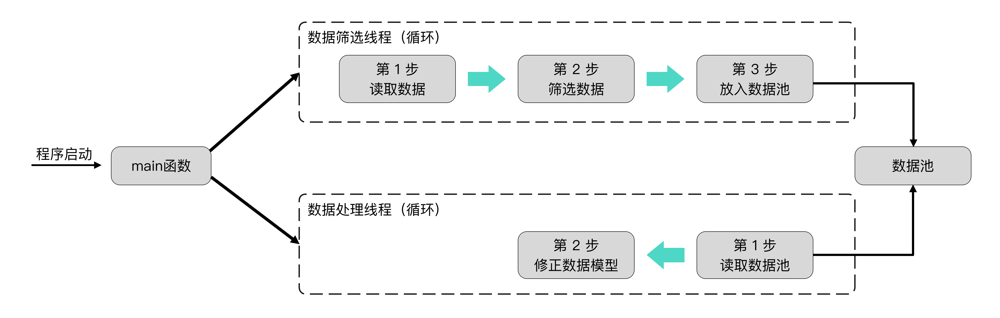
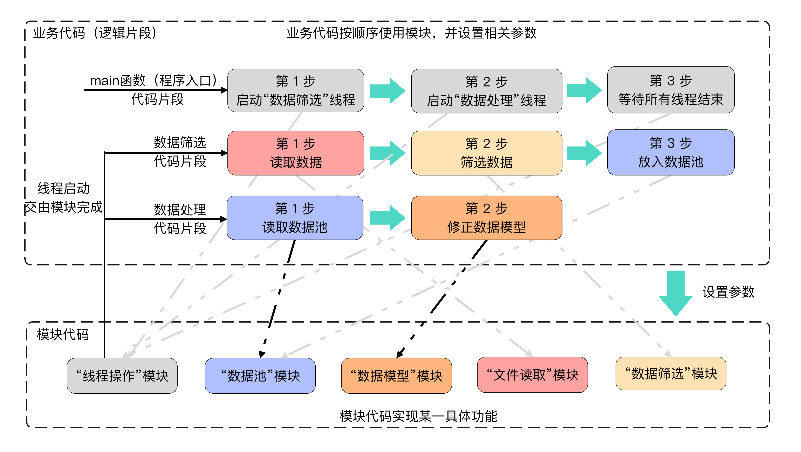
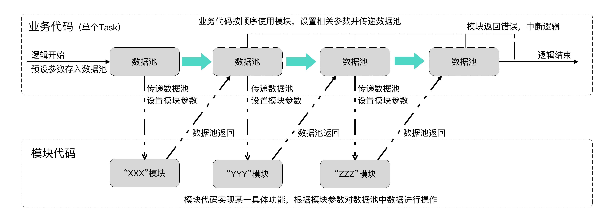
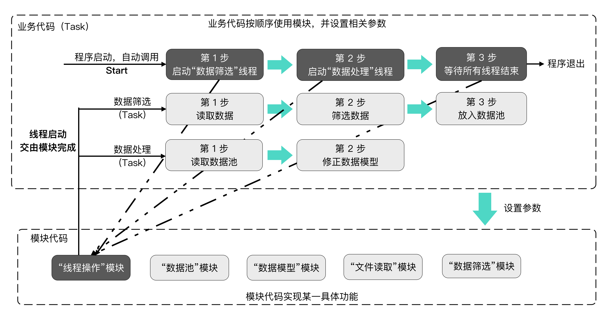
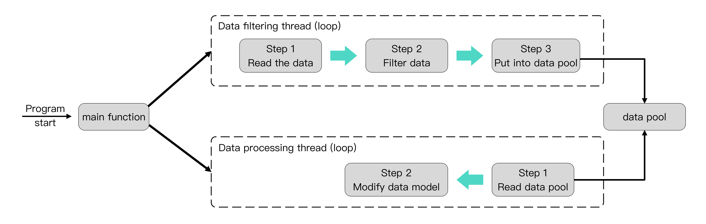
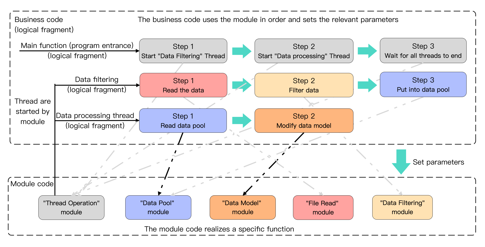
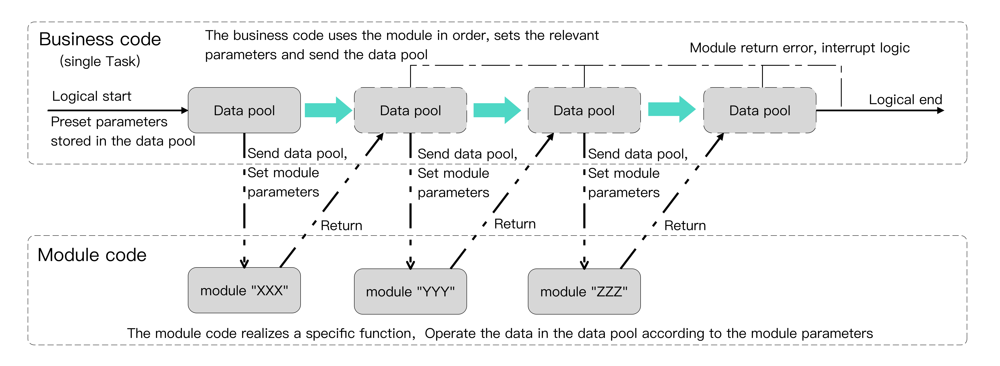
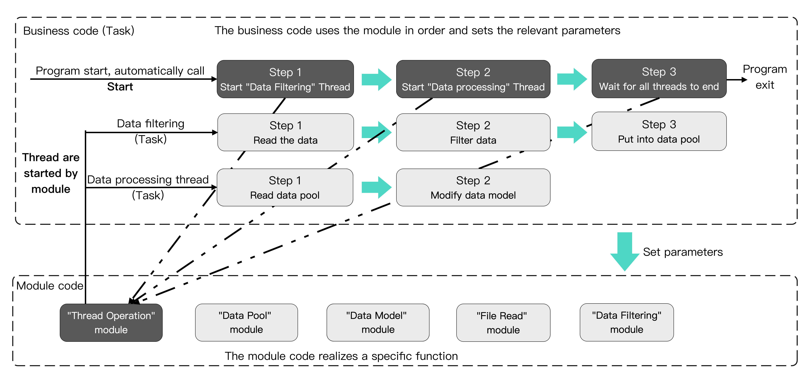

- 最新稳定版本: 2.0=2025.02.20
- 使用文档详见官网，[点击跳转使用手册](https://stoprefactoring.com/#content@content#framework/bees/)

- Latest stable version: 2.0=2025.02.20
- For the user manual, please refer to the official website, [click to jump to the user manual](https://stoprefactoring.com/#content@content#framework/bees/)

# 编写Linux/Unix C++引擎程序-就像组装机械一样

**Bees框架将代码分离了业务代码、模块代码**。业务代码由JSON配置，是对一个任务行为的模块使用顺序进行编排；模块代码是实际实现功能的代码，可无条件复用多个项目。

**Bees框架关注的是开发效率和维护成本**，业务开发由于不需要关心实际的运行原理，可交由经验较浅的程序员（或其他领域程序员）完成；模块代码虽然需要有一定C++等开发经验的程序员才能胜任，但是一经开发完成，即可无条件复用在多个项目。

Bees框架是一套前端应用的**顶层架构**，架构本身只约束了工程结构和开发过程，对前端应用的基础技术**无任何改造和深度封装，没有黑盒代码**。

**Bees框架只是一套规则**，实际上是一个C++（CMake、Conan）工程，任何问题都可以通过翻看实际代码排查。

# Write a Linux/Unix C++ engine - just like assembling machinery

**The Bees framework separates the code from the business code and the module code**. The business code is configured by JSON, which arranges the order of use of the module of a task behavior; the module code is the code that actually realizes the function, which can unconditionally reuse multiple projects.

**Bees framework focuses on development efficiency and maintenance costs**. Because business development does not need to care about the actual operating principle, it can be completed by inexperienced programmers (or programmers in other fields); although the module code requires programmers with certain development experience such as C++ to be competent, once opened After sending, it can be reused in multiple projects unconditionally.

The Bees framework is a set of **top-level architecture** for front-end applications. The architecture itself only restricts the engineering structure and development process. There is no transformation and in-depth encapsulation of the basic technology of the front-end application, and there is no black box code**.

**The Bees framework is just a set of rules**. In fact, it is a C++ (CMake, Conan) project. Any problems can be sorted out by looking through the actual code.

# 基础技术

Bees框架是一种顶层架构，架构本身只约束了工程结构和开发过程，对基础技术无任何改造和深度封装。

框架中采用的基础技术如下：

- **开发语言**：C++17
- **基础框架**：-
- **项目自动构建工具**：Conan2、CMake

其中，由于Bees框架只是一种规则，基础技术甚至是开发语言都是可以替换的，可联系官方打造个性化架构。

# Basic technology

The Bees framework is a top-level architecture. The architecture itself only constrains the engineering structure and development process, and does not have any modification and in-depth encapsulation of the basic technology.

The basic technologies adopted in the framework are as follows:

- **Development language**: C++17

- **Basic framework**:-

- **Project Automatic Building Tool**: Conan2, CMake

Among them, since the Bees framework is only a rule, the basic technology and even the development language can be replaced, and the official can be contacted to create a personalized architecture.

# 前提知识

在使用Bees架构前，**最好先学习C++17等**相关知识。

Bees框架只是一种规则，实际上是一个`C++`工程（CMake、Conan编译），要想深度使用、或者排查一些错误，最好先学习这些知识。

# Prerequisite knowledge

Before using the Bees framework, **you'd better learn C++17 and other **-related knowledge.

The Bees framework is just a rule. In fact, it is a `C++` project (Compiled by CMake, Conan). If you want to use it in depth or troublesto some errors, you'd better learn these knowledge first.

# 设计思想

Bees的设计思想与我们的后端框架Once是类似的：**希望所有代码都只写一次**。

代码可以只写一次的部分，希望能无条件复用在多个项目。代码不能只写一次的部分（业务强关联），那就简化其表达，用代码生成器生成它。

Linux/Unix的C++引擎程序虽然看起来十分复杂，包括线程、线程同步、核心算法等复杂问题，如音视频转码引擎、数据挖掘引擎、AI处理引擎等。

但是，从宏观上讲，引擎程序只是一个从main函数出发，多个逻辑片段的组合。而对于单个逻辑片段而言，是多个步骤的集合。

以一个简单的数据挖掘引擎为例，从main函数出发，启动了数据筛选线程、数据处理线程，每个线程都有独自的流程步骤，线程间通过数据池交流。

如果采用传统开发形式，将会是一个非常复杂的代码模型，代码量非常多，也很难维护。

**Bees框架将代码分离成了两层：模块代码、业务代码。**

**在Bees中，业务代码称为Task，模块代码称为Module。**

**模块代码是实际执行功能的代码**，只关心通用功能的实现，拥有统一的使用方式，所以这部分的代码可以只写一次，且可以**无条件复用**在多个项目。

**业务代码是跟业务强关联的**，也就是上面说的代码片段，只关心实现业务功能的步骤，也就是**对模块使用顺序进行编排**，例如：第一步读取数据，第二步筛选数据。所以业务代码可以使用JSON进行简化，并使用Christmas（代码生成器）生成代码。

# 工作原理

## 单个业务逻辑（单个Task）

为了实现模块代码、业务代码分离，**Bees框架加入了数据池**。

**数据池可以看作是一个功能流程的全局变量**，所有模块都可以对其进行添加、删除数据，数据池也就是模块使用说明中经常提到的`passParam`。

具体工作原理为：

- 在功能逻辑开始时，将预设数据存放在数据池中

- 功能逻辑调用模块时，需要设置模块参数，以及将数据池传递给模块

- 模块按模块参数执行任务时，根据模块参数从数据池获取数据，或根据模块参数对数据池进行修改

- 模块执行任务完毕后，检查模块是否报错，不报错继续下一步，否则中断逻辑

  > 报错返回只是默认行为，可以设置报错执行其他步骤的逻辑

## 程序启动、多个Task线程

**程序启动时**，会自动调用**名为Start的Task**，`Start`返回后，程序退出。

Bees可以创建任意多个Task，但是，默认状态下，除了`Start`以外的Task，都不会自动运行。

自定义的Task，需要由`Start`或者其他已经启动的`Task`，使用官方模块`_BrokerThread`创建线程并启动Task。

# Design ideas

The design idea of Bees is similar to our back-end framework Once: **Hope all code is written only once**.

The part of the code that can only be written once is hoped to be unconditionally reused in multiple projects. The part of the code that cannot be written only once (strong business association), then simplify its expression and generate it with a code generator.

Although the C++ engine program of Linux/Unix looks very complex, it includes threads, thread synchronization, core algorithms and other complex problems, such as audio and video transcoding engine, data mining engine, AI processing engine, etc.

However, from a macro perspective, the engine program is just a combination of multiple logical fragments starting from the main function. For a single logical fragment, it is a collection of multiple steps.

Take a simple data mining engine as an example. Starting from the main function, the data filtering thread and the data processing thread are started. Each thread has its own process steps, and the threads communicate through the data pool.

If the traditional development form is adopted, it will be a very complex code model, with a large amount of code and difficult to maintain.

**The Bees framework separates the code into two layers: module code and business code. **

**In Bees, the business code is called Task and the module code is called Module.**

**The module code is the code that actually executes the function**. It only cares about the implementation of general functions and has a unified way of use, so this part of the code can only be written once and can be **unconditionally reused** in multiple projects.

**The business code is strongly related to the business**, that is, the code snippet mentioned above, only cares about the steps to realize the business function, that is, **arrange the order of module use**, for example: the first step is to read data, and the second step is to filter data. Therefore, the business code can be simplified with JSON and the Christmas (code generator) can be used to generate code.

# Working principle

## Single business logic (single Task)

In order to realize the separation of module code and business code, **Bees framework has added a data pool**.

**The data pool can be regarded as a global variable of a functional process**. All modules can add and delete data to it. The data pool is also the `passParam` often mentioned in the module usage instructions.

The specific working principle is:

- At the beginning of the functional logic, store the preset data in the data pool

- When the functional logic calls the module, it is necessary to set the module parameters and pass the data pool to the module

- When the module performs tasks according to the module parameters, it obtains data from the data pool according to the module parameters, or modifies the data pool according to the module parameters

- After the module completes the task, check whether the module reports an error. If there is no error, continue to the next step. Otherwise, the logic will be interrupted

> The error return is only the default behavior, and you can set the logic of error reporting to perform other steps.

## Program startup, multiple Task threads

**When the program starts**, **Task named Start** will be automatically called. After `Start` returns, the program exits.

Bees can create any number of Tasks, but in the default state, Tasks other than `Start` will not run automatically.

Custom Task requires `Start` or other started `Task` to create threads and start Task by using the official module `_BrokerThread`.

# 历史版本

## 2.0
- 升级Christmas 2
- 业务代码改为Json配置（不需要写代码）
- 引入Conan2作为第三方库管理工具
- 模块增加初始化、清理时机，避免内存泄漏
- 增加模块库功能，可通过Christmas下载/更新模块代码
- 增加框架更新功能，可通过Christmas更新框架代码

## 1.0（停止维护）
- 业务代码、模块代码分层
- 模块迁移时，只需要克隆文件夹

# Historical version

## 2.0
- Upgrade Christmas 2
- Change the business code to Json configuration (no need to write code)
- Introduce Conan2 as a third-party library management tool
- The module increases the timing of initialization and cleaning to avoid memory leakage.
- Add the module library function, which can download/update the module code through Christmas
- Add the framework update function, and the framework code can be updated through Christmas

## 1.0 (stop maintenance)

- Business code and module code hierarchy

- When the module is migrated, you only need to clone the folder.
